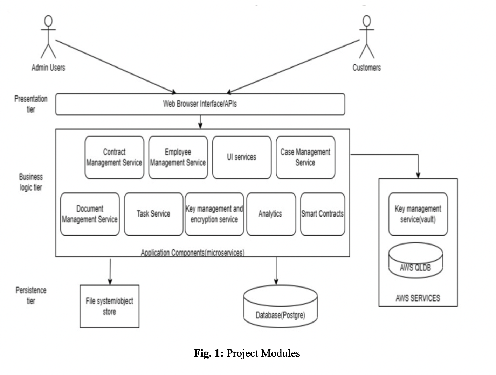

# Cloud-based-Management-System-for-Legal-Firms

A fullstack web application for small scale legal firms deployed on AWS. 
This repository contains the source code as well as the papers published as a part of my Capstone Project for my Computer Science and Engineering undergraduate degree at PES University.

The literature survey for this project was presented at the Second International Conference on Advances in Data-driven Computing and Intelligent Systems (ADCIS 2023) and can be found [here] (https://doi.org/10.56155/978-81-955020-2-8-54).


The Final paper for this project was presented at the Fifth International Conference on Computing and Network Communications (CoCoNET 2023) and can be found [here] (https://link.springer.com/book/9789819745395).


## Directory Structure

```
Cloud-based-Management-System-for-Legal-Firms

├── frontend
    ├── src
    └── App.js

├── backend
    ├── capstonelegal
        ├── src
            ├── main
                ├── java/com/capstonelegal
                └── Main.java

├── logs

```

## Project modules

The main features of this project include microservices that any legal tech corporate company should encompass, security features for gaining user trust, and deploying all of it on the cloud platform as a Saas product for ease of maintenance and cost effective management are the features implemented within the scope of this project.



