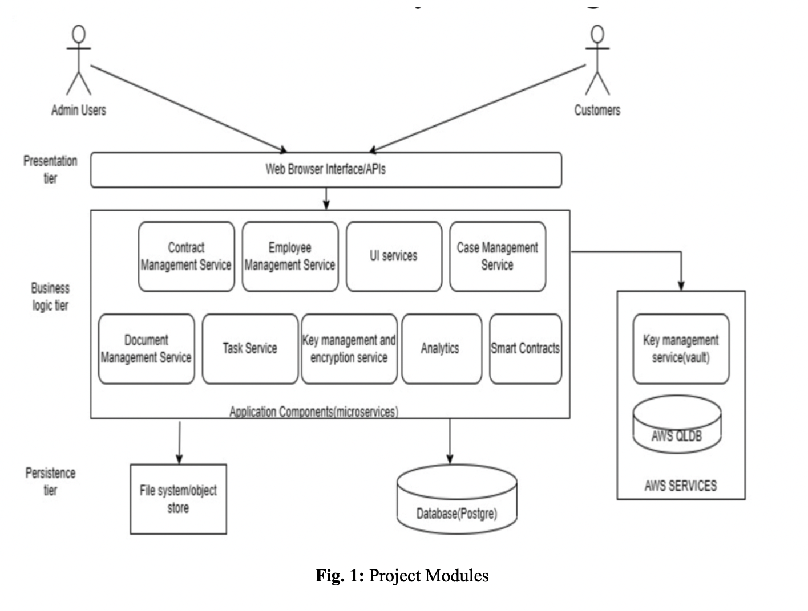

# Cloud-based-Management-System-for-Legal-Firms

A fullstack web application for small scale legal firms deployed on AWS. 
This repository contains the source code as well as the papers published as a part of my Capstone Project for my Computer Science and Engineering undergraduate degree at PES University.

> The literature survey for this project was presented at the Second International Conference on Advances in Data-driven Computing and Intelligent Systems (ADCIS 2023) and can be found [here](https://doi.org/10.56155/978-81-955020-2-8-54).


> The Final paper for this project was presented at the Fifth International Conference on Computing and Network Communications (CoCoNET 2023) and can be found [here](https://link.springer.com/book/9789819745395).


## Directory Structure

```
Cloud-based-Management-System-for-Legal-Firms

├── frontend
    ├── src
    └── App.js

├── backend
    ├── capstonelegal
        ├── src
            ├── main
                ├── java/com/capstonelegal
                └── Main.java

├── logs

```

## Project modules

The main features of this project include microservices that any legal tech corporate company should encompass, security features for gaining user trust, and deploying all of it on the cloud platform as a Saas product for ease of maintenance and cost effective management are the features implemented within the scope of this project.




## Project Setup


### Docker Desktop 

Download Docker Desktop for your system from the [Docker website.](https://www.docker.com/products/docker-desktop/). 
<br> 
To verify that Docker is working correctly, open a command prompt or terminal window and enter the following command:
`docker run hello-world`
If Docker is working correctly, you should see output indicating that the hello-world container has been downloaded and run successfully.

### PostGres Setup

Open Docker Desktop and make sure it is running.
Open a PowerShell terminal or command prompt window and enter the following command to download the PostgreSQL image from Docker Hub:
`docker pull postgres`

Please note that postgres username, password and port number must be configured.

After the image has been downloaded, enter the following command to start a container using the PostgreSQL image:
`docker run --name capstonelegaldb`

### Microservice Setup

Download the capstonelegalJM.zip file and extract it to any folder.
Ensure, Java 11+ is installed in your system
Import the project to your IntelliJ idea to build and create a jar file for the project using Maven.
Open a PowerShell terminal or command prompt window and enter the following command to build the services. 
For example: 
`docker build -t judge-management-service .`
Deploy and the image run in Docker Desktop:
`docker-compose up`

### Postman Setup
Download and install [Postman Client](https://www.postman.com/downloads/) to test the APIs

### Frontend Setup

This project was bootstrapped with [Create React App](https://github.com/facebook/create-react-app).

In the frontend directory, you can run:
 `npm start`

Runs the app in the development mode.\
Open [http://localhost:3000](http://localhost:3000) to view it in your browser.

The page will reload when you make changes.\
You may also see any lint errors in the console.
 
 `npm test`

Launches the test runner in the interactive watch mode.\
See the section about [running tests](https://facebook.github.io/create-react-app/docs/running-tests) for more information.
 
 `npm run build`

Builds the app for production to the `build` folder.\
It correctly bundles React in production mode and optimizes the build for the best performance.
Your app is ready to be deployed!

See the section about [deployment](https://facebook.github.io/create-react-app/docs/deployment) for more information.

### AWS Setup 

To get started, create an AWS account (for project purposes, a free trial will suffice).
Setup Amazon EC2 instances for the application. 
Upload the application.
Set up the required RDS and QLDB connections.

For more information about AWS and it's services, refer to [Deployments on an EC2/On-Premises Compute Platform](https://docs.aws.amazon.com/codedeploy/latest/userguide/deployment-steps-server.html), [Amazon RDS](https://docs.aws.amazon.com/rds/?nc2=h_ql_doc_rds) and [Amazon QLDB.](https://docs.aws.amazon.com/qldb/?icmpid=docs_homepage_databases)

